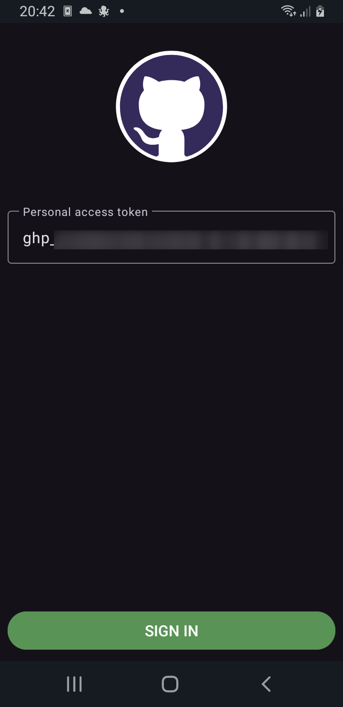
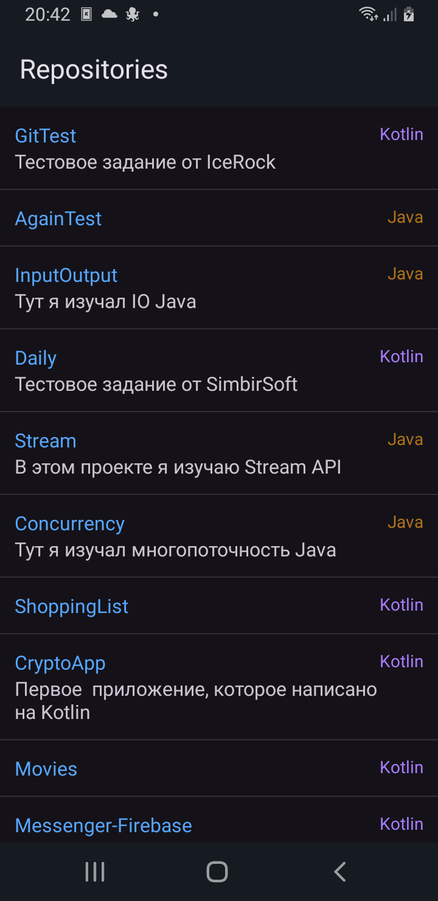
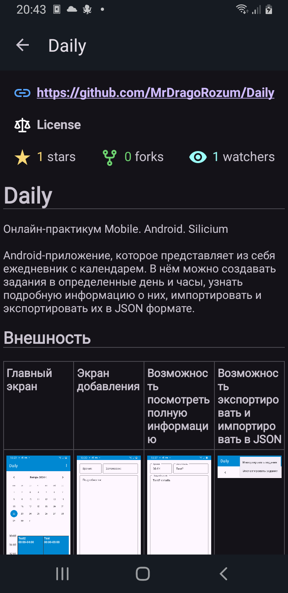

# GitTest (Github-клиент)
Стажировка от IceRock Development

Android-приложение, которое представляет собой простой Github-клиент. У него три экрана: авторизация, список проектов (читай как репозиторий), детальная информация проекта. 

**Авторизация**: клиент требует от вас токен ([Personal access tokens](https://docs.github.com/en/authentication/keeping-your-account-and-data-secure/managing-your-personal-access-tokens)),
он своем очереди должен предоставлять доступ к _repo_. При успешной авторизации токен автоматически сохраниться в клиенте и повторно вводить не нужно.
В случае ошибки (код HTTP, некорректный формат токена) будет выведена  соответствующая информация пользователю.

**Список проектов**: после авторизации будет выведен список 10 проектов, сортировка происходит по _pushed_.
На этом экране будет отображаться следующая информация о проекте: описание, язык и название.
В случае при потере интернета или ошибки со стороны клиента — будет выведена  соответствующая информация пользователю.

**Детальная информация проекта**: после выбора проекта из второго экрана (список проектов), у пользователя будет предоставлена следующая информация:
ссылка на проект, лицензия, stars, watchers, forks и README.md.
Клиент поддерживает следующее в README.md: изображение, GFM-таблицы (частично), кликабельные-ссылки, подсветка синтаксиса у большинства популярных языков.
Если изображения находятся в GitHub-проекте, то должен быть такой путь: _folder/image_, **в противном случае клиент не отобразит их!**
В случае при потере интернета или ошибки со стороны клиента — будет также выведена соответствующая информация пользователю.

Внешность
-
| Авторизация | Список проектов | Детальная информация проекта |
|-|-|-|
||||

Стек
-
Kotlin, Gradle (DSL Kotlin), jetpack: ViewModel (MVVM), Navigation (Safe Args), Hilt; Kotlin coroutines, Kotlin serialization, Splach Screen, Retrofit, okHttp, Markwon (и его плагины)

Контакты
-
Telegram https://t.me/APRozum
